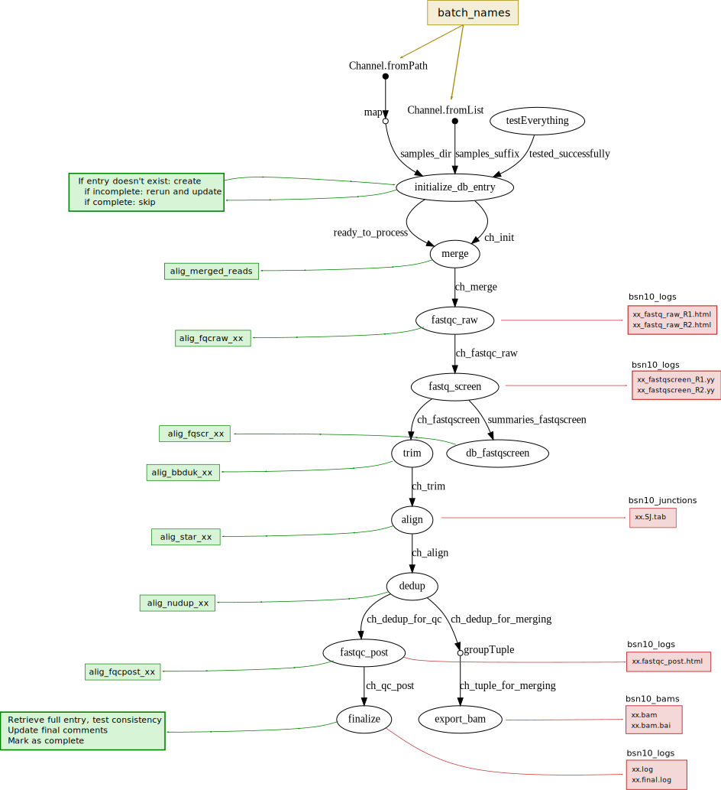

# Introduction

This is the workflow to process all sequencing data (obtained from the YCGA sequencing core), to obtain bam, SJ counts and gene coutns, along with useful information uploaded to the database. In addition, a number of log files are deposited in the corresponding directory, for further examination of samples that fail or display weird results.




# Prerequisites

Install [Nextflow](www.nextflow.io).
Install [NuDup](https://github.com/tecangenomics/nudup/).
Obtain database IDs and store them in `~/.cengen_database.id`.

Some processes call `R` code, and may require the following packages to be installed: `{readr}`, `{stringr}`, `{DBI}`, `{RMariaDB}`, `{wbData}`.


## Nextflow configuration
Before running Nextflow, you should create a config file at `~/.nextflow/config` with the following:

```
process.executor = 'slurm'
process.queue = 'general'

executor{
        queueSize = 20
}
```

And in `~/.bashrc` add (change the path to use your own scratch directory):
```
export NXF_WORK='/gpfs/ycga/scratch60/ysm/hammarlund/aw853/nextflow_workdir'
export NXF_TEMP='/gpfs/ycga/scratch60/ysm/hammarlund/aw853/nextflow_workdir'
```

Explanations: the content of the config file tell Nextflow that it should use SLURM, on a "general" partition, and can start up to 20 processes in parallel. The environment variables defined in bashrc indicate that the temporary files should be stored on the scratch partition. The workflow generates *a lot* of intermediary files, you don't want them stored in your project partition, or it will get full very quickly.

## Script
In your project directory (or scratch), copy the `align.nf` script.

I recommend creating a wrapper script, `run_nf.sh`, containing the following:
```
#!/bin/bash
#SBATCH --partition=general
#SBATCH --job-name=nf_wrap_bsn
#SBATCH -c 1
#SBATCH --mem=1G
#SBATCH --time=20-05:10:00

nextflow run align.nf -resume
```
it will ensure that Nextflow is started on a compute node, and that it won't get interrupted if you loose your connection. Alternatively, you can consider `screen` or `tmux`.


# Running the workflow

Before running, open the `nf` file, edit the parameters if relevant. For ex, include the new batches as needed. Do not modify anything below the message.

You can also check that the reference files (STAR index, ...) are available where they should be, possibly update to use a more recent version of Wormbase WS.

Run the script with `sbatch run_nf.sh` (if you created a wrapper as indicated above).

Outputs: in `/SAY`, create directories if needed:
* `bams`: bam files after alignment and deduplication
* `junctions`: the SJ.out.tab file created by STAR (not deduplicated)
* `logs`: various logs, the main one with a summary of all steps, but also STAR logs, and FASTQC HTML report

In addition, uploads a selection of relevant information to the database, use it to detect outliers etc.


After running, check the slurm file (if using a wrapper), and the `.nextflow.log` hidden file for errors. In case of errors, the log file should contain the path to the temporary directory where the command was run, you can check the files in there.

In run_nf.sh, you can add a `-with-dag dag10.dot` option. The dot file can be converted to svg using [Graphviz](http://www.graphviz.org/) with `dot -Tsvg dag10.dot -o dag10.svg`.


# History of pipelines:

* bss2: BBduk (trimming) + STAR (mapping) + SAMtools (for dedup), used for the scRNA-Seq paper (because the panneuronal samples had no UMI measured)
* bsn3: BBduk (trimming) + STAR (mapping) + NuDup (for dedup), but mistake preventing metadata to be uploaded to database (so, gives an error message)
* bsn4 (not used): same as bsn3, but with correct database update
* bsn5,bsn6: BBduk + STAR + NuDup, written in Nextflow, including database update and QC. These were development versions, not really used.
* bsn7: BBduk+STAR+NuDup, with junction files exported, FASTQC and saving in the "cengen" database (vs test database previously). Note: the QC and alignements being processed in parallel resulted in a mixing of samples: the names of the publishDir files were incorrect.
* bsn8: qc and alignment done successively to keep sample names.
* bsn9: same results as bsn8, but processes refactored to have a single step per process.
* bsn10: fastq-screen before alignment, additional fastQC after alignment (on the bam). In addition, refactoring: database gets updated by each relevant process so the Channel that gets passed around contains only the main files.

